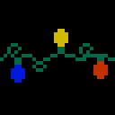

|  |
|:--:|
| [0013-mickey](https://github.com/letmaik/pixelart/blob/master/sprites/0013-mickey.aseprite) |

|  |
|:--:|
| [0012-santa](https://github.com/letmaik/pixelart/blob/master/sprites/0012-santa.aseprite) |

|  |
|:--:|
| [0011-xmas-string-lights](https://github.com/letmaik/pixelart/blob/master/sprites/0011-xmas-string-lights.aseprite) |

|  |
|:--:|
| [0010-carrie](https://github.com/letmaik/pixelart/blob/master/sprites/0010-carrie.aseprite) |

|  |
|:--:|
| [0009-arthur](https://github.com/letmaik/pixelart/blob/master/sprites/0009-arthur.aseprite) |

|  |
|:--:|
| [0008-doug](https://github.com/letmaik/pixelart/blob/master/sprites/0008-doug.aseprite) |

|  |
|:--:|
| [0007-stargate](https://github.com/letmaik/pixelart/blob/master/sprites/0007-stargate.aseprite) |

|  |
|:--:|
| [0006-dalek](https://github.com/letmaik/pixelart/blob/master/sprites/0006-dalek.aseprite) |

|  |
|:--:|
| [0005-alien](https://github.com/letmaik/pixelart/blob/master/sprites/0005-alien.aseprite) |

|  |
|:--:|
| [0004-candle](https://github.com/letmaik/pixelart/blob/master/sprites/0004-candle.aseprite) |

|  |
|:--:|
| [0003-xmas-light](https://github.com/letmaik/pixelart/blob/master/sprites/0003-xmas-light.aseprite) |

|  |
|:--:|
| [0002-xmas-tree-lines](https://github.com/letmaik/pixelart/blob/master/sprites/0002-xmas-tree-lines.aseprite) |

|  |
|:--:|
| [0001-xmas-tree](https://github.com/letmaik/pixelart/blob/master/sprites/0001-xmas-tree.aseprite) |

